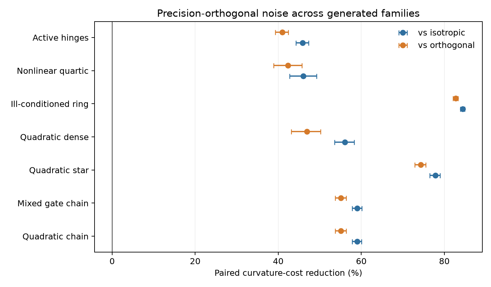
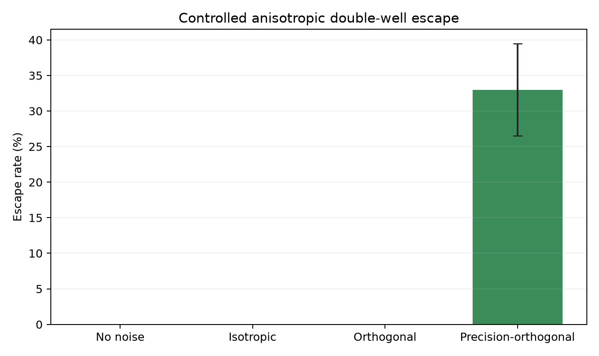
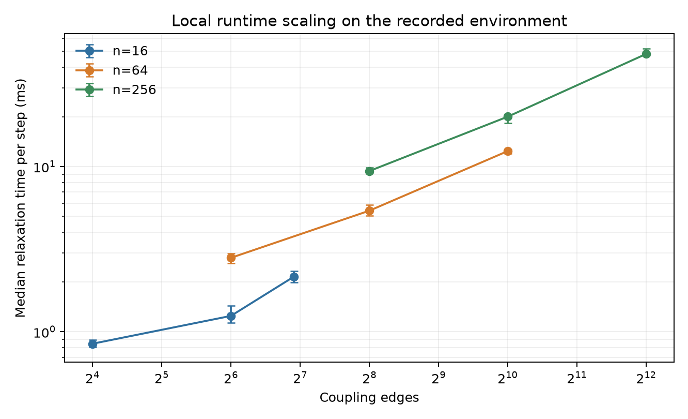

# Complexity from Constraints: The Neuro‑Symbolic Homeostat
## Composable Energy Relaxation with Precision-Scaled Orthogonal Noise and Stability Guards

**Authors:** Oscar Goldman
**Date:** November 2025
**Revision:** July 2026
**Status:** Research prototype with mechanism-level synthetic validation

### Abstract

We present a neuro-symbolic coordination framework that represents selected logical constraints as energy terms and computes constraint-conditioned order-parameter states by relaxation. The main mechanism is a composable curvature contract: modules report local stiffness, couplings report curvature bounds, and the coordinator composes those reports into precision-aware updates, geometry-matched step caps, and noise scaling. For the executed diagonal-preconditioned update, the guard bounds $P^{-1/2}HP^{-1/2}$ using the exact positive diagonal $P$ that divides the gradient. This gives a $P$-norm contraction theorem for box-projected relaxation on quadratic objectives with an SPD Hessian. Ordinary projected gradient descent retains a separate Euclidean theorem. The quadratic stiffness path is weighted Jacobi and reduces to classical Jacobi at relaxation parameter one. Gaussian belief propagation solves the same Gaussian linear-inference problem through explicit messages, but this repository does not implement GaBP or claim stepwise equivalence. Counterfactual gate-benefit couplings consume caller-supplied frozen benefit values, and precision-scaled orthogonal noise uses final re-projection plus uniform box-feasible scaling. Synthetic experiments measure their mechanism-level behavior; broader task-level benefits remain empirical.

---

## 1. Introduction

Modern “System‑1” models can produce useful scores while still violating explicit constraints. Symbolic solvers can enforce rules but often require crisp inputs and discrete decisions. We develop a relaxation layer that
- represents constraints as energy terms,
- adds exploration under acceptance checks, and
- uses curvature reports to scale updates and cap steps.

Our core design principle is modular coordination: modules expose order parameters and energies; the coordinator relaxes the global energy with first-order tangent exploration, update-geometry stability guards, and non-local gate updates.

### 1.1 Proof status

This paper separates mechanism validity, guard behavior, and empirical benefit. A mechanism can follow from the stated energy rule and still require empirical tests to show fewer steps, lower final energy, lower constraint violation, or changed behavior on a given task class.

- CGBC validity: `GateBenefitCoupling` implements $F=-w\,\eta_{\text{gate}}\,\Delta_{\text{benefit}}$, so $\partial F/\partial\eta_{\text{gate}}=-w\,\Delta_{\text{benefit}}$. The caller supplies $\Delta_{\text{benefit}}$, and the coordinator snapshots it as a finite value for the complete solver call. The mechanism applies that supplied credit signal; it does not derive a counterfactual estimate.
- CGBC direction and empirical behavior: the sign of the frozen benefit controls the force direction. A positive value pushes the gate upward under gradient descent. A wrong-sign value pushes in the wrong direction and must be detected by the caller's estimator or downstream acceptance criteria.
- PSON validity: after inverse-precision weighting, the implementation projects again, giving $g^\top\delta=0$ above the numerical gradient threshold. Uniform box-feasible scaling preserves that equality. This establishes a first-order tangent direction, not a Hessian null vector or a flat direction.
- PSON cost and empirical behavior: the second-order term $\tfrac12\beta^2\delta^\top H\delta$ can be positive, so the implementation relies on bounded magnitude, precision scaling, and rejection/restoration. Section 7 measures the exact synthetic full-Hessian quadratic form separately from a diagonal curvature proxy. A controlled anisotropic double-well experiment measures escape behavior in one designed regime; task-level effects remain untested.
- Ordinary-gradient stability: for a quadratic objective with SPD Hessian $H$, the box-projected map contracts in the Euclidean norm when a valid raw bound gives $0<\alpha<2/L_H$.
- Preconditioned stability: for the executed update $x^+=\Pi_{[0,1]^n}(x-\alpha P^{-1}\nabla F(x))$, the bound is formed from $A=P^{-1/2}HP^{-1/2}$ using the exact positive diagonal $P$ used by the update. If $0<\alpha<2/L_P$, then the projected map contracts in the $P$-norm for an SPD quadratic.
- Small-Gain benefit: the current allocator spends a global estimated margin and reports row margins. Fewer steps or lower final energy depends on the task and remains empirical.
- Stiffness/Jacobi validity: for quadratic/SPD systems with $P=D=\operatorname{diag}(H)$, synchronous stiffness updates are weighted Jacobi with relaxation parameter $\alpha$. Classical Jacobi is the case $\alpha=1$. Gaussian BP is a related message-passing solver for the same linear-inference problem; it is not implemented or tested here. Sequential Gauss-Seidel remains an algebraic reference and future scheduler target.

### 1.2 Scope of contribution and empirical regime boundary

This repository uses standard optimization mathematics:
- gradient descent stability condition $\alpha < 2/L$,
- Gershgorin-style row-sum upper bounds for conservative Lipschitz control,
- diagonal preconditioning and weighted-Jacobi stationary iterations for quadratic/SPD blocks.

The repository-specific contribution is the composable curvature contract, with two distinct local curvature paths:
- module `SupportsPrecision.curvature` values feed the diagonal precision cache, the update preconditioner $P$, and precision-aware noise;
- local Hessian contributions for the raw and normalized Gershgorin bounds are independently finite-differenced from local gradients;
- coupling curvature feeds both paths where supported, although active hinges contribute starting-state curvature to the cache and worst-case cross-region curvature to the step bound.

The raw Hessian bound is therefore not derived from the precision cache. The preconditioned step cap normalizes its Hessian component bounds with the exact positive diagonal used by the update.

Current tests cover two proof boundaries:
- Quadratic normalized-bound regime: tests compare the implemented matrix $I-\alpha P^{-1}H$ against the symmetric normalized matrix $I-\alpha P^{-1/2}HP^{-1/2}$. They cover randomized SPD systems, box projection, scale invariance, and the one-dimensional small-precision case that fails if the guard bounds $H$ while executing a $P^{-1}H$ update.
- Mixed-curvature regime: built-in hinges use worst-case curvature across active-set crossing. Nonlinear, state-dependent, and custom terms require segment-valid reports for a fixed-step theorem, or projected Armijo backtracking. The final rejection guard preserves accepted-state monotonicity but does not supply a missing curvature bound.

---

## 2. Theoretical Framework

### 2.1 Four views
- Physics (Energy Minimization): Relax toward lower energy under local and coupling terms.
- Control theory: the geometry-matched Gershgorin cap gives a sufficient contraction condition in the stated quadratic/SPD regime. The Small-Gain allocator is a bounded curvature-spend heuristic, not a nonlinear certificate.
- Statistics (Gaussian Graphical Models): a quadratic energy and a Gaussian model can define the same precision system $Jx=h$. The coordinator has coupling factors and no Gaussian message objects.
- Information theory: interpreting precision as confidence or inverse variance can guide experiments. The current implementation does not estimate channel capacity or prove SNR adaptation.

### 2.2 Precision‑Scaled Orthogonal Noise (PSON)
Standard Langevin noise can add a component along the gradient. PSON constructs a first-order tangent direction, biases it with inverse precision, and then projects again because diagonal weighting generally breaks the first orthogonality condition. In Euclidean mode,

$$
\delta_0=\Pi_{g^\perp}z,
\qquad
\delta_1=W\delta_0,
\qquad
\delta=\Pi_{g^\perp}\delta_1,
\qquad z\sim\mathcal N(0,I),
$$

(Eq. 1)

Here $g=\nabla F(x)$, $z$ is a Gaussian draw, and $W$ is the configured inverse-precision weight operator. The final vector is normalized to the requested noise magnitude. The implementation then applies the largest single scalar that keeps the whole perturbation inside the unit box. A uniform scalar preserves $g^\top\delta=0$; independent coordinate clipping generally would not.

PSON explores directions tangent to the current energy level set to first order. This property does not imply a Hessian null space or zero second-order curvature. In the synthetic ablation in Section 7, precision scaling reduced the exact initial box-feasible full-Hessian quadratic cost relative to isotropic and unscaled orthogonal noise.

When a symmetric positive definite problem metric $M$ is available, the metric gradient is $g_M=M^{-1}g$. The metric projection is $M$-orthogonal to $g_M$, which is equivalent to $g^\top\delta=0$. A dense metric uses a linear solve with $M$; matrix-free callers can provide the action of $M^{-1}$ through `metric_solve`. After precision weighting, the implementation re-projects with the same geometry.

Proposition (Quadratic PSON first-order property). Let $F(x) = \tfrac12 (x-x^\star)^\top H (x-x^\star)$ with $H \succeq 0$ and ordinary gradient $g = \nabla F(x) = H(x-x^\star)$. In Euclidean mode, project the noise orthogonal to $g$. In metric mode with SPD metric $M$, project along $g_M=M^{-1}g$ using $\delta=z-\frac{g^\top z}{g^\top M^{-1}g}M^{-1}g$. Apply any precision scaling before a final projection with the selected geometry. Then the final vector satisfies $g^\top \delta = 0$, and
$\Delta F \;=\; F(x+\beta\delta) - F(x) \;=\; \tfrac12 \beta^2 \delta^\top H \delta \;\ge\; 0.$
Thus, a pure noise move is generally second-order uphill in positive-curvature directions. The implementation preserves accepted-step monotonicity through the down-only acceptance rule. Precision scaling reduces the measured curvature cost in the synthetic ablation by biasing $\delta$ before the final orthogonality projection. When $\lVert g\rVert<10^{-8}$, the projection helper returns the noise unchanged because the gradient does not define a reliable normal. This branch is stationary-point exploration; first-order tangency is numerically vacuous there.

### 2.3 Counterfactual gate-benefit coupling (CGBC)
Counterfactual gate-benefit coupling (CGBC), nicknamed a wormhole coupling in the implementation, lets closed gates receive forces proportional to a caller-supplied estimate of downstream benefit. Before solver dispatch, the coordinator converts the supplied delta to a finite float inside a read-only top-level constraint snapshot. The value remains fixed for the complete solver call, and the original caller mapping is restored afterward. With gate-benefit energy

$$
F_{\text{gate}} = -w\, \eta_{\text{gate}}\, \Delta_{\text{benefit}},
$$

(Eq. 2)
the gradient w.r.t. the gate is independent of the current gate value:

$$
\frac{\partial F}{\partial \eta_{\text{gate}}} = -w\, \Delta_{\text{benefit}}.
$$

(Eq. 3)
This provides a non-local gate force akin to the “nudge” in Equilibrium Propagation. It applies the caller's credit signal without backpropagating through an inactive path. CGBC does not calculate the counterfactual benefit.

Explicit sign check. From (Eq. 3), $\mathrm{sign}\big(\partial F/\partial \eta_{\text{gate}}\big) = -\,\mathrm{sign}(\Delta_{\text{benefit}})$. Thus when downstream benefit is positive, the gradient pushes the gate upward (reducing energy), irrespective of the current $\eta_{\text{gate}}$; conversely for negative benefit.

### 2.4 Stability and the Gaussian linear-system link
The guard distinguishes the raw Hessian from the update geometry. Ordinary box-projected gradient descent is controlled by $H$. A diagonal-preconditioned step is controlled by $A=P^{-1/2}HP^{-1/2}$, using the same positive diagonal $P$ that divides the gradient. For an SPD quadratic, a valid bound $L_P\ge\lambda_{\max}(A)$ and $0<\alpha<2/L_P$ make the box-projected map contractive in the $P$-norm.

For a quadratic objective with SPD precision $J$, minimizing $F(x)=\tfrac{1}{2}x^\top Jx-h^\top x$ is equivalent to solving $Jx=h$. With $P=D=\operatorname{diag}(J)$, the implemented update $x\leftarrow x-\alpha D^{-1}(Jx-h)$ is weighted Jacobi; $\alpha=1$ gives classical Jacobi. Gaussian belief propagation is another distributed method for Gaussian inference and can recover the same mean when its message updates converge, subject to its own conditions. General GaBP also updates message precisions, so its transient iterations are not identified with the coordinator's weighted-Jacobi trajectory.

---

## 3. Quadratic Relaxation and Related Message Passing

Consider quadratic energy

$$
\displaystyle F(x) = \tfrac{1}{2} x^\top J x - h^\top x
$$

(Eq. 4)
with SPD precision matrix $J$.

We denote $D = \mathrm{diag}(J)$ and write $J = D + L + U$ with $L$ strictly lower and $U$ strictly upper triangular. Classical linear iterations give:

- The update $x^{t+1}=x^t-\alpha D^{-1}(Jx^t-h)$ is weighted Jacobi. It is classical Jacobi when $\alpha=1$, $P=D$, the epsilon floor is inactive, and box clipping does not alter the proposal.
- A triangular solve with $(D+L)^{-1}$ gives the Gauss-Seidel trajectory; that scheduler is not implemented here.
- GaBP uses edge messages with evolving cavity precisions. When it converges on the corresponding Gaussian model, its mean solves $Jx=h$, but its intermediate updates need not match Jacobi or Gauss-Seidel.

The shared linear system provides the connection between the methods. It does not make the algorithms stepwise identical. Weighted-Jacobi convergence requires $\rho(I-\alpha D^{-1}J)<1$. Walk-summability provides a separate sufficient convergence condition for Gaussian BP and is related to diagonal-dominance classes.

Scope and realization. The current implementation realizes synchronous projected weighted Jacobi through per-coordinate stiffness updates in the stated quadratic case. It divides the gradient by a positive diagonal $P$ aggregated from module and coupling curvature and floored by the active epsilon. It has no Gaussian message objects, cavity-precision updates, or dedicated sequential Gauss-Seidel scheduler.

---

## 4. Architecture & Mechanisms

### 4.1 Modules, Energies, and Precision
Modules expose order parameters and implement local energies. Couplings encode interactions (springs, hinges, and CGBC/wormhole terms). A `SupportsPrecision` interface elevates curvature to a first-class signal. The coordinator aggregates a nonnegative diagonal cache $\Lambda$ from module and coupling curvature. For either preconditioned update mode it constructs

$$
P_{ii}=\max(\varepsilon,\Lambda_{ii}),
\qquad
\Delta\eta_i=-\alpha\frac{\partial F/\partial\eta_i}{P_{ii}}.
$$

The update and normalized stability bound consume this exact $P$. PSON uses the curvature cache to bias exploration, then re-projects to restore first-order tangency. Vectorized graph caches avoid Python overhead.

### 4.2 Stability Guard and Small-Gain Allocator
The implementation uses Gershgorin row sums in the geometry of the executed update. Let $\bar h_{ii}$ and $\bar h_{ij}$ bound the absolute diagonal and off-diagonal Hessian entries. The raw bound is

$$
\lambda_{\max}(H)\le
L_H=\max_i\left(\bar h_{ii}+\sum_{j\ne i}\bar h_{ij}\right).
$$

(Eq. 5)

For diagonal preconditioning, define $A=P^{-1/2}HP^{-1/2}$. The implemented normalized bound is

$$
\lambda_{\max}(A)\le
L_P=\max_i\left(
\frac{\bar h_{ii}}{p_i}
+\sum_{j\ne i}\frac{\bar h_{ij}}{\sqrt{p_i p_j}}
\right).
$$

(Eq. 6)

The guard selects $L_{\mathrm{update}}=L_P$ for a preconditioned step and $L_{\mathrm{update}}=L_H$ otherwise, then uses

$$
\alpha_{\mathrm{used}}
=\min\!\left(\alpha_{\mathrm{requested}},\gamma\frac{2}{L_{\mathrm{update}}}\right),
\qquad 0<\gamma<1.
$$

(Eq. 7)

Gradient realization. Components may supply analytic derivatives. Otherwise, the coordinator finite-differences every coordinate of the full objective; it does not prune isolated nodes merely because other nodes are coupled. The shared fallback uses a centered second-order stencil in the interior and a three-point second-order one-sided stencil at either box boundary, with all probes inside $[0,1]$. These stencils recover the derivative of a quadratic exactly up to floating-point error, so the quadratic map below is also realized by the finite-difference path in that numerical sense. For a general nonlinear energy, the fallback is an approximation and the theorem does not extend beyond its stated quadratic assumptions.

Theorem (box-projected preconditioned quadratic contraction). Let $F(x)=\tfrac12x^\top Hx-h^\top x$, $H\succ0$, $C=[0,1]^n$, and $P\succ0$ diagonal. Let $x_C^\star$ be the unique constrained minimizer and

$$
T_P(x)=\Pi_C^P\left(x-\alpha P^{-1}\nabla F(x)\right).
$$

For diagonal $P$, projection onto the axis-aligned box is coordinate clipping in both the Euclidean and $P$ metrics. If $L_P\ge\lambda_{\max}(P^{-1/2}HP^{-1/2})$ and $0<\alpha<2/L_P$, then

$$
\lVert T_P(x)-x_C^\star\rVert_P
\le q_P\lVert x-x_C^\star\rVert_P,
\qquad
q_P=\max_{\lambda\in\sigma(A)}|1-\alpha\lambda|<1.
$$

(Eq. 8)

The constrained minimizer is a fixed point of $T_P$. The $P$-metric projection is nonexpansive, and the transformed affine error map is $I-\alpha A$, which proves the inequality. With $P=I$, the same argument gives the separate ordinary projected-gradient theorem in the Euclidean norm with $A=H$ and $L_H$.

Built-in directed and asymmetric hinges contribute their worst-case curvature across active and inactive regions, so the bound covers an active-set crossing. For nonlinear modules, state-dependent curvature, and custom coupling bounds, the fixed-step theorem requires a report that remains valid over the segment from the accepted state to the projected proposal. When that contract is unavailable, projected Armijo checks the realized displacement $s=\Pi_C(x-\alpha d)-x$ using

$$
g^\top s\le0,
\qquad
F(x+s)\le F(x)+c\,g^\top s.
$$

If every backtracking trial fails, the state remains unchanged. The final monotonicity guard restores any other uphill proposal.

Telemetry calls $(2/L_{\mathrm{update}})-\alpha_{\mathrm{used}}$ the step-cap slack. This value is not the contraction factor $q_P$. Earlier configuration and log names containing `contraction_margin` remain deprecated aliases. `inspect_state()` reports raw `lipschitz_bound`, geometry-matched `update_lipschitz_bound`, cached `precision_diagonal`, and the exact `preconditioner_diagonal`.

The optional Small-Gain adapter treats the remaining estimated row-sum margin as a budget for bounded coupling-weight increases. It supplies a global curvature-spend policy and telemetry; it is not a nonlinear small-gain certificate.

### 4.3 Counterfactual gate-benefit couplings (CGBCs)
`GateBenefitCoupling` implements CGBC, with “wormhole coupling” retained as the implementation nickname. It applies a non-local gradient even for a closed connection when the caller supplies a downstream benefit value. The value remains frozen for the complete solver call. The plain coupling and `DampedGateBenefitCoupling` at power $p=1$ are linear and contribute zero Hessian curvature. For damped power $p\ge2$, writing the gate energy as $-a\eta^p$, the implementation reports the exact box-wide absolute diagonal bound $|a|p(p-1)$. This magnitude bound does not imply positive curvature: the term is concave when $a>0$, and the quadratic contraction theorem still requires the total Hessian to be SPD. For nonzero $a$ and $1<p<2$, no finite closed-box gradient-Lipschitz bound exists at zero; a fixed-step guarded run fails closed unless projected Armijo is enabled. When the frozen coefficient is zero, the term and its curvature report are zero. Powers below one are rejected. The mechanism consumes the supplied credit signal and does not derive it. In the current repository CGBC is tested on synthetic gating cases; broader planning and sequence uses remain hypotheses to test with task-level ablations.

### 4.4 Precision‑Scaled Orthogonal Noise (PSON)
First-order tangent exploration with a monotone acceptance guard. Precision-aware scaling biases perturbations before a final orthogonality projection. The final box-feasibility operation scales the complete vector uniformly. The current evidence supports lower exact full-Hessian curvature cost for precision-orthogonal noise in the synthetic ablation; the diagonal curvature proxy is reported separately. Escape behavior and task-level effects remain empirical claims to test on broader tasks.

---

## 5. Algorithms (Composing Matrix Math and Messages)

The maintained default is guarded gradient relaxation, with optional diagonal stiffness scaling. `SolverConfig` selects one of three mutually exclusive paths: gradient, proximal, or ADMM-like relaxation. Grouped `CoordinatorConfig` objects separate gradient, execution, guard, noise, weight, and solver settings for new callers; the flat constructor remains for compatibility.

In mature supervised-learning recipes, catastrophic gradient-descent instability is uncommon because many guardrails are already present. In custom energy systems with non-smooth terms, stiff constraints, coupled objectives, or feedback-like dynamics, step-size sensitivity becomes more central. The optional proximal and ADMM paths exist for those regimes, not as a replacement for ordinary gradient methods.

**Penalty and primal-dual placement.** The default path relaxes primal order parameters under the configured energy and optional adaptive term weights. The ADMM-like path introduces auxiliary and scaled dual variables for selected quadratic and hinge terms; gate-benefit terms use either their gradient or a damped proximal-linear update. This path remains experimental because the current evidence covers synthetic conformance cases rather than general nonconvex convergence.

Implemented kernels:
- Default path: analytic or finite-difference gradients, optional diagonal stiffness scaling, a Gershgorin-style step cap, optional tangent noise, and accepted-step guarding.
- Proximal path: local gradient updates followed by supported pairwise or star-block proximal updates.
- Experimental ADMM-like path: selected quadratic, hinge, and gate-benefit updates with auxiliary and dual variables plus primal and dual residual telemetry.

`tests/test_solver_conformance.py` applies one contract to all three paths. On a bounded two-variable convex quadratic with a closed-form optimum, each path returns finite in-range states, preserves non-increasing accepted energy, and reaches the reference within its stated numerical tolerance. Deliberately oversized proximal and ADMM-like steps test rejection and restoration. On the ADMM convex reference, both recorded residuals fall below $10^{-3}$ after 100 accepted steps. Gate-benefit tests cover the separate proximal-linear update. These checks support the implemented paths on the tested objectives; they do not establish convergence for arbitrary nonconvex compositions.

**Pseudocode Sketch (Implemented Default Path):**

```python
for attempt in range(steps):
    baseline = energy(eta, current_weights)
    gradient = compose_gradient(eta, current_weights)
    curvature_cache = compose_precision(eta, current_weights)
    preconditioner = (
        positive_epsilon_floor(curvature_cache)
        if preconditioning_enabled
        else ones_like(gradient)
    )
    update_bound = compose_update_geometry_bound(
        eta, current_weights, preconditioner
    )
    direction = gradient / preconditioner
    if projected_armijo_required(config, update_bound):
        deterministic, armijo_ok = projected_armijo(eta, gradient, direction)
        if not armijo_ok:
            record_rejected_attempt("armijo_failed_no_step")
            if continue_after_rejection:
                continue
            break
    else:
        step = requested_step
        if isfinite(update_bound) and update_bound > 0:
            step = min(step, safety_fraction * 2 / update_bound)
        deterministic = project_to_box(eta - step * direction)
    noise = build_reprojected_tangent_noise(gradient, curvature_cache)
    proposal = add_largest_uniform_box_feasible_noise(deterministic, noise)
    if energy(proposal, current_weights) <= baseline:
        eta = proposal
        emit_accepted_state(eta)
        current_weights = adapt_weights_after_acceptance(eta, current_weights)
    elif not continue_after_rejection:
        break
```

---

## 6. Observability

The implementation includes relaxation trackers and stability telemetry: per-step ΔF, acceptance provenance, step-cap slack, raw and update-geometry Lipschitz bounds, row and global margin estimates, precision and preconditioner diagonals, and budget-versus-spend fields for Small-Gain. The older `contraction_margin` field remains a deprecated alias for step-cap slack; it is not a measured contraction factor. These signals make convergence and stability behavior inspectable during experiments.

---

## 7. Empirical Guidance and Repro

- Orthogonal vs isotropic noise: compare ΔF histograms and sharpness at matched loss.
- Precision‑aware vs uniform noise scaling: escape events, ΔF90, final energy.
- Small-Gain vs line-search-only vs GradNorm: fixed-reference energy, adaptive-objective energy, ΔF90, and backtracks.
- CGBC/wormhole ablation: activation/opening rates vs energy drop versus hinge/quadratic baselines.

**Table 1: Paired PSON box-feasible full-Hessian cost ablation across generated problem families**

Command: `uv run python -m experiments.ablate_pson_noise --trials 30 --steps 80 --noise-cost-samples 32 --bootstrap-samples 10000`

Protocol: each family uses 30 generated seeds and 80 attempted relaxation steps. The three noise modes receive the same problem instance and raw Gaussian draws. Rejected proposals restore the previous state, and the remaining schedule continues. For each mode and seed, the noise builder first returns a requested-magnitude vector $q$. The experiment applies the same largest uniform box-feasible scale used by the coordinator at the initial state, giving the realized displacement $\delta=sq$. The primary cost is the mean exact synthetic full-Hessian value $\delta^\top H\delta$ over 32 draws. The raw CSV separately retains requested-vector costs, realized costs, box-scale statistics, and the diagonal curvature proxies. The effect is the paired percentage reduction in realized precision-orthogonal full-Hessian cost relative to each baseline. Intervals are percentile 95% confidence intervals from 10,000 paired hierarchical bootstrap resamples over problem seeds and draw indices.

| Scenario | Structure | Size | Reduction vs isotropic | Reduction vs orthogonal |
|---|---|---:|---:|---:|
| Quadratic chain | Chain, quadratic | 12 | 59.65% [57.79%, 61.15%] | 55.67% [53.88%, 57.18%] |
| Mixed gate chain | Chain, quadratic plus linear CGBC | 12 | 59.65% [57.78%, 61.21%] | 55.68% [53.94%, 57.19%] |
| Quadratic star | Hub-and-spoke, shuffled curvature | 12 | 77.89% [76.32%, 79.20%] | 74.27% [72.54%, 75.66%] |
| Quadratic dense | Dense random graph | 6 | 56.55% [53.76%, 58.96%] | 47.70% [44.18%, 50.82%] |
| Ill-conditioned ring | Ring, local curvature ratio 400 | 24 | 83.77% [82.39%, 84.68%] | 82.10% [80.76%, 83.06%] |
| Nonlinear quartic | Chain, state-dependent curvature | 12 | 45.89% [42.53%, 49.10%] | 41.85% [38.33%, 45.19%] |
| Active hinges | Chain with active directed/asymmetric hinges | 12 | 47.23% [45.52%, 48.77%] | 41.45% [39.77%, 43.02%] |



Interpretation. Precision-orthogonal noise had lower measured initial box-feasible full-Hessian cost in every generated family. Mean paired reductions ranged from 45.89% to 83.77% relative to isotropic noise and from 41.45% to 82.10% relative to unscaled orthogonal noise. The mixed-gate and quadratic-chain cost results are nearly identical because the added CGBC term is linear and therefore changes the gradient but not the Hessian. Mean energy drop remained similar across noise modes within each family. Precision-orthogonal noise had the highest mean acceptance rate in five of seven families; it did not have the highest rate in the quadratic-chain or mixed-gate-chain runs. Raw trial metrics, including requested and realized full-Hessian costs, box-scale statistics, and separately labeled diagonal proxies, are recorded in `logs/pson_noise_ablation.csv`; realized full-Hessian paired effects and bootstrap intervals are recorded in `logs/pson_noise_ablation_summary.csv`.

These intervals quantify sampled seed and perturbation-draw variation under the specified generators. They do not include uncertainty about the choice of graph families, energy constructions, or hyperparameters, and they do not establish task-level benefit. Real-model evaluation is deferred.

### 7.1 Closed-form noise-cost reference

For a three-dimensional diagonal quadratic with curvature $(2,4,16)$, a gradient aligned with the first coordinate, and fixed noise norm $0.02$, the expected isotropic cost is $\beta^2\operatorname{tr}(H)/3$. Orthogonal projection leaves a two-dimensional tangent plane with expected cost $\beta^2(4+16)/2$. In that plane, inverse-curvature weighting gives the weighted harmonic expression $\beta^2(4w_2+16w_3)/(w_2+w_3)$, where $w_i=(H_{ii}+\varepsilon)^{-1}$.

| Mode | Analytic cost | Monte Carlo cost, 100,000 draws | Relative error |
|---|---:|---:|---:|
| Isotropic | 2.933333e-3 | 2.936314e-3 | 0.102% |
| Orthogonal | 4.000000e-3 | 4.000612e-3 | 0.015% |
| Precision-orthogonal | 2.560000e-3 | 2.559886e-3 | 0.004% |

This reference checks the implemented normalization, projection, and precision weighting against a case with a closed-form expectation. It also shows that orthogonality alone can raise curvature cost when the removed gradient direction is relatively flat.

### 7.2 Sampled curvature-contract audit

Command: `uv run python -m experiments.audit_curvature_contract --samples 32 --strict`

The auditor compares reported module and coupling curvature with finite-difference Hessian entries. Across 32 states in each of the seven generated families, all 6,080 sampled component-state records were covered; none were unreported or underreported. A separate negative test deliberately underreports a custom edge and verifies that the auditor labels it. This is sampled diagnostic evidence, not a proof between sampled states.

### 7.3 Controlled nonconvex escape

The escape benchmark uses one asymmetric double-well coordinate and seven stiff quadratic distractor coordinates. All modes start at the higher stationary well. Noise modes receive the same fixed Euclidean norm of $0.55$, 40 attempts, and down-only acceptance. The construction is intentionally anisotropic: inverse-curvature weighting allocates more of the fixed norm to the escape coordinate.

| Mode | Escapes / 200 | Escape rate | Mean energy drop |
|---|---:|---:|---:|
| No noise | 0 | 0.0% | 0.000000 |
| Isotropic | 0 | 0.0% | 0.000000 |
| Orthogonal | 0 | 0.0% | 0.000000 |
| Precision-orthogonal | 66 | 33.0% | 0.006974 |

The paired escape-rate difference for precision-orthogonal noise versus no noise was 33.0 percentage points with a percentile 95% bootstrap interval of [26.5, 39.5]. The same interval applies versus isotropic noise because that baseline had no escapes. This result supports escape behavior only for this controlled anisotropic construction. At the initial stationary point the gradient is zero, so orthogonality is vacuous; the observed difference isolates precision allocation rather than tangent projection.



### 7.4 Local runtime scaling

The scaling benchmark varies problem size over 16, 64, and 256 variables and edge count from 16 to 4,096. Each graph regime runs in a fresh Python process with two warmups and seven timed repeats. Median relaxation time ranged from 0.846 ms per step at 16 variables and 16 edges, with an interquartile range of 0.805 to 0.896 ms, to 48.141 ms at 256 variables and 4,096 edges, with an interquartile range of 47.275 to 51.679 ms. Peak traced Python allocation ranged from 20.7 KiB to 1.16 MiB; this `tracemalloc` measurement does not include every native allocation or process-level resident byte.

The recorded run used Windows, CPython 3.12.1, NumPy 2.2.4, and the `scipy-openblas` backend. A descriptive log-linear fit over the nine measured regimes gave size and edge-count exponents of 0.413 and 0.536 with $R^2=0.994$. Correlation between graph dimensions and implementation details limits that fit, so it is an empirical summary of this matrix rather than an asymptotic complexity result. The benchmark records raw samples and environment metadata in `logs/scaling_benchmark.csv`; `logs/scaling_model.json` stores the fit. Measurements from a second machine or software stack remain future evidence.



**Reproducibility Commands (Windows PowerShell):**

```powershell
# CGBC/wormhole demo
uv run python -m experiments.demo_wormhole

# Unit tests (subset)
uv run -m pytest tests -k "gate_benefit or couplings" -v

# Adapter comparison sweep (example)
uv run python -m experiments.benchmark_delta_f90 --configs default gradnorm smallgain --steps 60

# SmallGain validation sweep (see docs/SMALLGAIN_VALIDATION_FINAL.md)
uv run python -m experiments.sweep_smallgain --quick

# Verify tests, audits, references, figures, paths, and recorded artifacts
.\scripts\verify_publication.ps1

# Regenerate the full recorded experiment set before verification
.\scripts\verify_publication.ps1 -Regenerate
```

Note: To enable stiffness‑based per‑coordinate updates in your own scripts, construct the coordinator with `use_stiffness_updates=True`; adapters (Small‑Gain, etc.) remain unchanged and continue to shape the effective stiffness through term weights.

---

## 8. Future Work

- Asynchronous/priority scheduling variants for sparse graphs: implement prioritized updates and compare wall‑clock efficiency against synchronous passes.
- Extend the controlled escape result to nonconvex families that do not deliberately align low curvature with the escape coordinate.
- Evaluate constraint correction on real model outputs. Real-model evaluation is deferred in the current repository release.

---

## 9. Limitations

- The implemented stiffness path is weighted Jacobi for the stated quadratic/SPD system when $P=\operatorname{diag}(H)$; classical Jacobi additionally requires $\alpha=1$, an inactive epsilon floor, and no box-clipping change. Gaussian BP is related literature context, not an implemented solver path.
- Curvature underreporting or a start-point-only bound that fails along the proposal segment invalidates the fixed-step contraction premise. Projected Armijo can test shorter realized displacements. Monotone restoration prevents an uphill proposal from replacing accepted state, but it cannot recover a missing bound or guarantee progress.
- Update preconditioning uses a positive diagonal approximation. The theorem controls the full Hessian through the normalized matrix $P^{-1/2}HP^{-1/2}$; it does not assume that $P$ diagonalizes $H$.
- The controlled escape construction is designed to test anisotropic precision allocation and is not representative of arbitrary nonconvex landscapes.
- The curvature audit samples states and can detect observed underreporting; it cannot certify unsampled states.
- CGBC consumes a caller-supplied benefit value that is converted to a finite float and remains frozen for the complete solver call. Damped powers strictly between one and two require the projected-Armijo handling stated in Section 4.3. Benefit-estimation quality affects activation dynamics; broader planning and sequence claims require task-level tests beyond the synthetic gating tests.

---

## 10. Related Work

- Equilibrium Propagation (Scellier & Bengio): nudge‑based non‑local gradient in energy‑based models.
- Gaussian BP and walk-sums (Weiss & Freeman; Malioutov et al.): Gaussian mean inference and sufficient convergence conditions.
- Small‑gain/passivity (Zames; Vidyasagar): loop‑gain constraints for stability in nonlinear feedback systems.
- Operator‑splitting/ADMM (Boyd et al.): proximal and primal‑dual updates for composite objectives.

Walk-summability and diagonal dominance. Following Malioutov et al., walk-summability gives a sufficient convergence condition for Gaussian BP and is related to diagonal-dominance classes. The coordinator separately uses Gershgorin row sums to bound quadratic curvature for its gradient step. These mechanisms share matrix structure but establish different algorithm-specific conditions.

---

## 11. Conclusion

The main result is a composable energy-relaxation contract whose guard matches the executed geometry. On an SPD quadratic, the diagonal-preconditioned box-projected map contracts in the $P$-norm when the normalized Gershgorin bound covers $P^{-1/2}HP^{-1/2}$. This is a stronger and more specific result than applying an unpreconditioned $2/L$ cap to a preconditioned direction. Built-in hinge bounds cover active-set crossing. Nonlinear and custom terms require segment-valid reports or projected Armijo. The framework depends on accurate curvature contracts, exact agreement between the bounded and executed preconditioner, and evidence that remains separate from the formal result.

---

### References

Acknowledgement: this work was influenced by Furlat's Abstractions repository, especially its distributed-computation techniques: https://github.com/furlat/Abstractions

Theory references:

1. Weiss, Y., & Freeman, W. T. (2001). Correctness of Belief Propagation in Gaussian Graphical Models of Arbitrary Topology. Neural Computation.
2. Malioutov, D., Johnson, J. K., & Willsky, A. S. (2006). Walk‑sums and belief propagation in Gaussian graphical models. Journal of Machine Learning Research.
3. Saad, Y. (2003). Iterative Methods for Sparse Linear Systems. SIAM.
4. Scellier, B., & Bengio, Y. (2017). Equilibrium Propagation: Bridging the Gap Between Energy‑Based Models and Backpropagation. Frontiers in Computational Neuroscience.
5. Zames, G. (1966). On the input‑output stability of time‑varying nonlinear feedback systems. IEEE TAC.
6. Vidyasagar, M. (1993). Nonlinear Systems Analysis. Prentice Hall.
7. Boyd, S., Parikh, N., Chu, E., Peleato, B., & Eckstein, J. (2011). Distributed Optimization and Statistical Learning via the Alternating Direction Method of Multipliers. Foundations and Trends in Machine Learning.
8. Boyd, S., & Vandenberghe, L. (2004). Convex Optimization. Cambridge University Press.
9. Varga, R. S. (2000). Matrix Iterative Analysis, 2nd ed. Springer.

---

### Citation

If you use this repository in your research, please cite it. This is ongoing work; we would like to know your opinions and experiments. Thank you.

**Authors:** Oscar Goldman - Shogu Research Group @ Datamutant.ai, subsidiary of 温心重工業.

**Reference (author-year format):** Goldman, O. (2025). *Complexity from Constraints: The Neuro-Symbolic Homeostat*. Software repository. Shogu Research Group @ Datamutant.ai, subsidiary of 温心重工業.


---

### License

MIT License

© 2025 Oscar Goldman
Status: research prototype
---

### Notes on implementation

- Codebase: Python, protocol-based architecture using NumPy for the current implementation.
- Vectorization: runtime coupling caches amortize sparse gradient and energy passes for supported coupling families.
- Observability: callback-driven telemetry (`RelaxationTracker` and `EnergyBudgetTracker`) records energy descent, step-cap slack, raw and update-geometry curvature summaries, precision summaries, and adapter spend. Deprecated contraction-margin names remain compatibility aliases.
- Precision layer: implemented; diagonal curvature aggregates module and coupling curvature, supports per-coordinate stiffness-based steps (`use_stiffness_updates`), and supports precision-scaled PSON with re-projection after weighting.
- Solver layer: one explicit mode dispatches to guarded gradient, proximal, or ADMM-like relaxation. The split solvers restore rejected states and report mode-specific acceptance and residual metrics.
- Configuration layer: immutable grouped configuration is the preferred entry point; flat coordinator keyword arguments remain available for compatibility and focused ablations.

